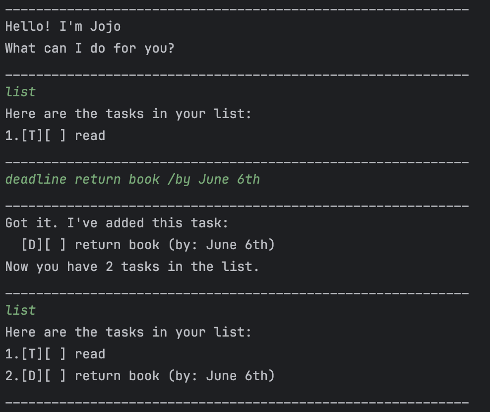

# Jojo User Guide



Jojo is a simple text-based chatbot that helps you keep track of **todos**, **deadlines**, and **events** — right from your terminal.  
You can **add**, **list**, **mark**, **delete**, **find**, and **save** tasks easily with a few commands.

## Adding todos

Adds a simple todo task to your list.

**Example:**
`todo read book`

**Expected output:**
```
____________________________________________________________
Got it. I've added this task:
[T][ ] read book
Now you have 1 tasks in the list.
____________________________________________________________
```

## Adding deadlines

Adds a task with a due date.

**Example:**
`deadline return book /by Sunday`

**Expected output:**
```
____________________________________________________________
Got it. I've added this task:
  [D][ ] return book (by: Sunday)
Now you have 2 tasks in the list.
____________________________________________________________
```

## Adding events

Adds a task with a start and end time.

**Example:**
`event project meeting /from Mon 2pm /to 4pm`

**Expected output:**
```
____________________________________________________________
Got it. I've added this task:
  [E][ ] project meeting (from: Mon 2pm to: 4pm)
Now you have 3 tasks in the list.
____________________________________________________________
```

## Listing all tasks

Shows all tasks currently stored in the list.

**Example:**
`list`

**Expected output:**
```
____________________________________________________________
Here are the tasks in your list:
1.[T][ ] read book
2.[D][ ] return book (by: Sunday)
3.[E][ ] project meeting (from: Mon 2pm to: 4pm)
____________________________________________________________
```

## Marking tasks

Marks a task as completed.

**Example:**
`mark 1`

**Expected output:**
```
____________________________________________________________
Nice! I've marked this task as done:
  [T][X] read book
____________________________________________________________
```

## Unmarking tasks

Marks a task as not completed.

**Example:**
`unmark 1`

**Expected output:**
```
____________________________________________________________
OK, I've marked this task as not done yet:
  [T][ ] read book
____________________________________________________________
```

## Deleting tasks

Removes a task from the list.

**Example:**
`delete 2`

**Expected output:**
```
____________________________________________________________
Noted. I've removed this task:
  [D][ ] return book (by: Sunday)
Now you have 2 tasks in the list.
____________________________________________________________
```

## Finding tasks by keyword
Searches for tasks containing a keyword in their description.

**Example:**
`find book`

**Expected output:**
```
____________________________________________________________
Here are the matching tasks in your list:
1.[T][ ] read book
2.[D][ ] return book (by: Sunday)
____________________________________________________________
```

## Exiting the program

Ends the session. Tasks are saved automatically to ./data/duke.txt.

**Example:**
`bye`

**Expected output:**
```
____________________________________________________________
Bye. Hope to see you again soon!
____________________________________________________________
```